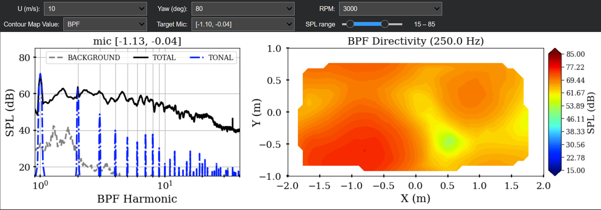

# Interactive Visualizer for Virginia Tech Experimental Data

This repository contains an interactive Jupyter Notebook to visualize the noise of a 5-bladed, 12-inch radius eVTOL propeller measured in the Virginia Tech Stability Wind tunnel. It is designed to run in a browser with Google Colab. The code plots a directivity map of values of either the Blade Passage Frequency $(RPM\*N_{blades}/60)$ or broadband noise integrated from 500 to 20000 Hz, and a plot of the spectra of the total, phase-averaged (tonal), and background noise at a user-selected microphone. The user can also interactively vary inflow velocity U, propeller yaw angle and RPM, and the SPL range of the plots. This code only includes the 16-degree blade collective measurements.

## Quickstart! Click "Open in Colab" below to open in your browser.

Data from Virginia Tech:

Huang, S.-F., Chaware, S. S., Lundquist, R., Intaratep, N., and Alexander, W. N.
 (2025). Noise of a Propeller Designed for eVTOL Operations in Forward and Edgewise Flight. 
 In *Proceedings of the Vertical Flight Society’s 81st Annual Forum*, Virgnia Beach, VA, USA. 
 The Vertical Flight Society.
